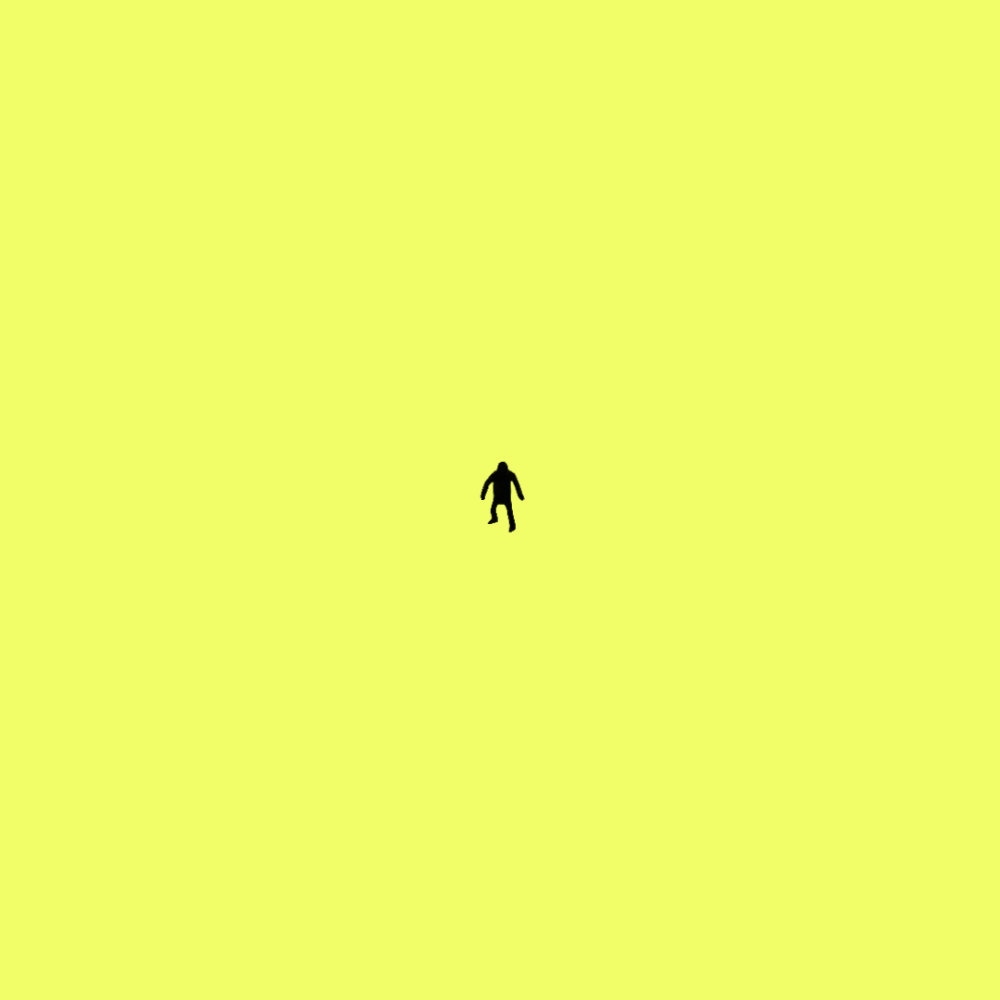

# 3D Character
A 3D model of the Tinyman character is available to help while creating animations, memes, or any brand-related visual element. Tinyman-style or any kind of animations can be produced from this model.

To produce Tinyman-style animations, you can rig the .FBX model with [Mixamo](https://www.mixamo.com/)'s Auto-Rigger plugin and use the existing poses and animations there. Then, you can give the feeling of frame-by-frame animation by using the effects in the After Effects sample file in the Animations section. 

To learn more about Tinyman animations and see examples, visit the ["Animations"](../Animations) & ["Emojis"](../Emojis) section.

