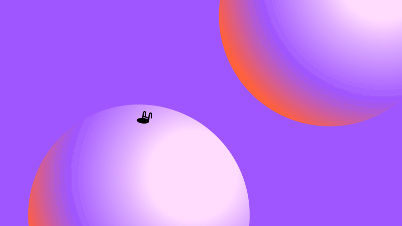
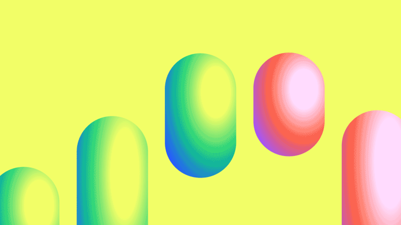

# Animations
Tinyman has an unique animation style:
- Small animation in a big composition
- Character silhouette
- Colorful background
- Frame-by-frame like
- Movements that make you smile

To create Tinyman-style animations, you must first prepare a background by using colors and gradients from the ["Color Palette"](../Color_Palette) and place the frame by frame character animation into the composition. Instead of working on frame animations every time, you can use the Tinyman model in the ["3D Character"](../3D_Character) section and give the feeling of a cartoon through After Effects. The related effect can be found in the sample After Effects file in this file.

You can visit the ["Emojis"](../Emojis) section to see more animation examples.

| Animation |
| ----------- | 
|  | 
|  | 
|  | 

