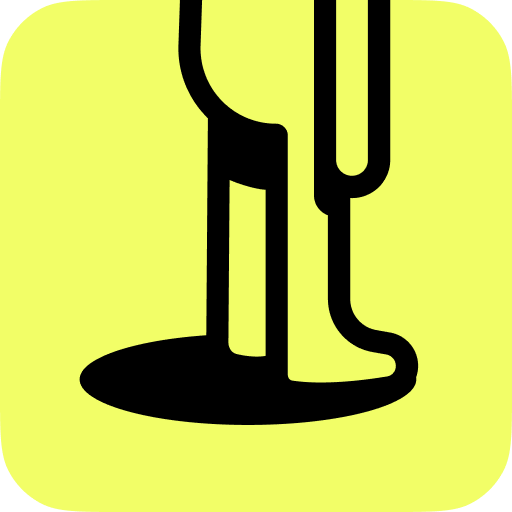
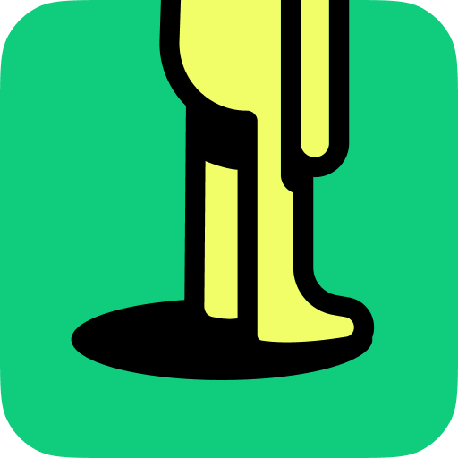

# App Icon

| Main | Secondary  |
| ----------- | ----------- |
|  |  |

&nbsp;

This usage should be preferred for very smaller sizes such as application icon, favicon, asset icon etc. Mostly, the main icon should be preferred, but in cases where the background is not separated by yellow, alternative icon can also be preferred.

If you are looking for the full size Tinyman character, you should be in [Logo/Logo_Icon](../Logo/Logo_Icon/).