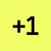

# Emojis
Tinyman has various emojis for use in channels such as Discord, Slack. These emojis and animations are created from the Tinyman 3D character. You can visit the ["Animations"](../Animations) section to get more information and to contribute to this section.

&nbsp;

| Emoji | Name |
| ----------- | ----------- |
|  | `:tinyman-dance:` | 
|  | `:tinyman-jump:` | 
|  | `:tinyman_britney:` | 
|  | `:tinyman-pool:` | 
|  | `:tinyman-rage:` | 
|  | `:gm:` | 
|  | `:gmi:` | 
|  | `:gn:` | 
|  | `:lol:` | 
|  | `:plusone:` | 
|  | `:plz:` | 
|  | `:no:` | 
|  | `:np:` | 
|  | `:ty:` | 
|  | `:why:` | 
|  | `:wtf:` | 
|  | `:yes:` | 
|  | `:questionmark_3:` | 
|  | `:questionmark_1:` | 
|  | `:1_t:` | 
|  | `:2_i:` | 
|  | `:3_n:` | 
|  | `:4_y:` | 
|  | `:going_up:` | 
|  | `:going_down:` | 

