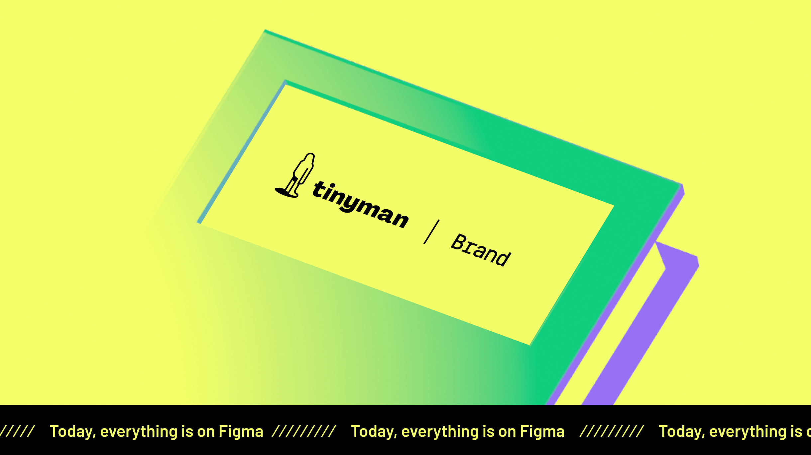

# Tinyman Brand Assets

This repository is the primary location for downloading Tinyman brand assets like logos, color swatches, fonts, and other brand elements.

&nbsp;

## Table of Contents
- Logo & Tinyman
- App Icon
- Color Palette
- Typefaces
- Visual Assets
- 3D Character
- Emojis
- Animations

&nbsp;

## Tinyman ❤️ Figma

If you want to access more detailed files of the Tinyman brand and even edit them according to yourself and create your own visual assets [everything is available on Figma](#). You are able to duplicate the file and edit according to your needs. 

